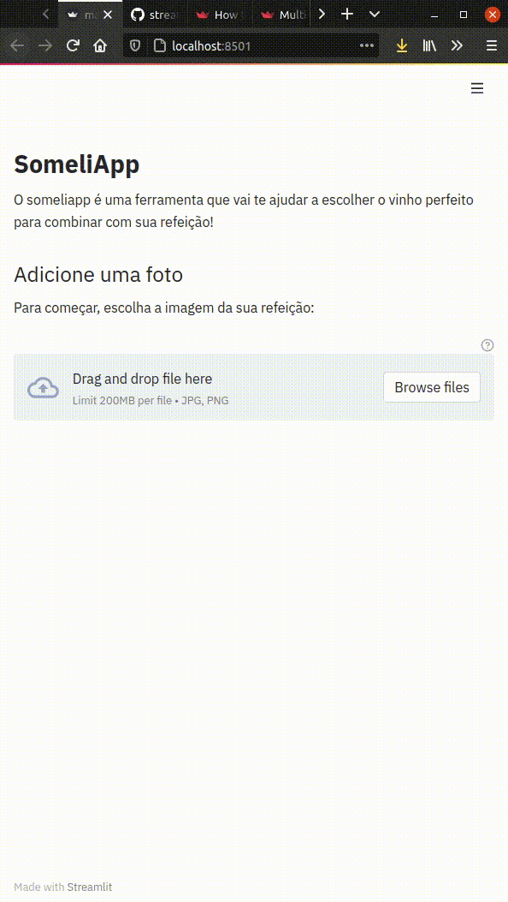

# Someliapp 

This is a MVP to showcase an AI Model that suggests wines based 
on a food picture uploaded by the user. It was made with Streamlit.

Showcase GIF (in portuguese):



## How to run

It is pretty straightfoward.

At your terminal, assuming that you are at the project's root directory, do:

```
$ pip3 install -r requirements.txt
$ streamlit run app.py
```

Then visit the URL `http://localhost:8501` at your favourite browser and you are ready to go :)
